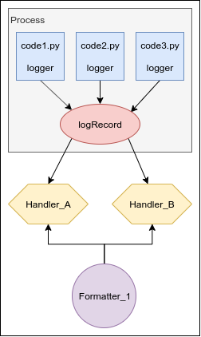

Title: Un petit guide (non exhaustif) sur le logging en Python
Date: 2020-01-05 12:34
Category: Article
Slug: logging-python
Author: ZepmanBC

## Ce jour où le `print()` doit sortir de ta vie

Alors oui le `print()` c'est rapide et facile, mais on l'utilise parce que le logging n'est pas quelque chose qui est utilisé régulièrement donc on ne sait pas trop comment s'y prendre.

Pour démarrer voici le code de survie minimum qui te permettra de passer du coté des *loggers*.

    # A mettre au début du code
    import logging
    logging.basicConfig(level=logging.DEBUG)
    logger = logging.getLogger(__name__)

    # ICI DU CODE #
    variable = 12

    # là où tu mettais un print(), maintenant tu mets ça:
    logger.debug(f"ma variable : {variable}")

Voici ce que cela affichera:

    DEBUG:__main__:ma variable : 12

Tu peux arrêter de lire ici et revenir quand tu sentiras le besoin d'approfondir, tu es un *logger*, félicitation!

## Les différents niveaux et quand les utiliser

Le logging permet d'avoir 5 niveaux de granularité suivant ce que tu souhaites afficher. L'avantage est de pouvoir laisser toutes les lignes DEBUG et de remonter le niveau d'affichage pour ne plus les voir. C'est terminé le temps où tu repassait au peigne fin tout ton code pour commenter/supprimer les print()!

Comme tu l'auras deviné dans le code de base, c'est cette ligne qui définit le niveau minima d'affichage, tu peux essayer de le changer et les lignes de niveau inférieur ne s'afficheront plus dans la console:

    logging.basicConfig(level=logging.DEBUG)

Voici les 5 niveaux par ordre croissant avec une proposition d'utilisation, mais rien n'est normalisé.

* **DEBUG**: il doit être utilisé uniquement lors du debuggage, par exemple dans une boucle pour voir tout ce qu'il se passe et pouvoir comprendre le processus, cela permet de rentrer dans le détail.
* **INFO**: c'est le niveau où on peut afficher les différentes étapes pour prévenir qu'une action est lancée ou un appel est effectué. On prend un peu de recul/hauteur par rapport au DEBUG.
* **WARNING**: pour prévenir d'un événement hors de l'utilisation standard mais qui n'est pas une erreur, par exemple un utilisateur qui utilise un mauvais mot de passe. Ce n'est pas une erreur de programme.
* **ERROR**: quand une exception est remontée, une opération a échouée.
* **CRITICAL**: à utiliser en cas extrême, pour un manque de place de mémoire, un serveur qui est HS, un problème qui est hors de notre contrôle.

Tu définis le niveau en changent la méthode de ton logger:

    logger.debug()
    logger.info()
    logger.warning()
    logger.error()
    logger.critical()

Il existe également le `logger.exception()` qui est en fait au niveau ERROR et qui va rajouter le message de l'exception automatiquement après notre message définit.

## Les différentes sorties

L'affichage dans la console c'est bien mais quand on pense au logging on imagine des fichiers *.log.

Effectivement il est possible de ressortir les logs de beaucoup de manières différentes. Pour comprendre comment cela se passe:

Dans chaque fichier de l'application que l'on veut suivre on créé un *logger*.

L'application est dans un processus qui contient le *logRecord* qui récupère toutes les données envoyés par les *loggers*.

La configuration par défaut (basicConfig) renvoie les données dans la console, mais il est possible de créér autant de *Handler* (gestionnaire) que l'on souhaite qui permettront de configurer la **sortie** et le **niveau**.

Il est donc possible par exemple que le *Handler_A* écrive dans un fichier au niveau DEBUG et le *Handler_B* envoie un mail au niveau WARNING. De cette manière on est prévenu quand il y a un événement non prévu et il est possible de consulter le fichier de log pour retracer les événements.

Il existe différents types de sortie comme la console, des fichiers, l'envoie de mail, le streaming vers un serveur, etc... La doc officielle pour plus d'exhaustivité: [logging.handlers](https://docs.python.org/fr/3/library/logging.handlers.html)

## Le formatage

La sortie standard nous donnait quelque chose sous cette forme dans le code minimal: `DEBUG:__main__:ma variable : 12`.

Cela correspond à la configuration par défaut: `%(levelname)s:%(name)s:%(message)s`

Il est possible de changer la nature et la forme des informations que l'on souhaite en créant des *Formatters* qui seront attribué à des *Handlers*

Un *Formatter* peut être attribué à plusieurs *Handlers*, mais on peut en créer un spécifique pour chaque.

Voici le code pour modifier le formatage:

    import logging
    # logging.basicConfig(level=logging.DEBUG)  # ligne inutile mais pour montrer qu'on n'est plus sur la config par défaut
    logger = logging.getLogger(__name__)

    c_handler = logging.StreamHandler()  # Création d'un handler vers la console
    c_handler.setLevel(logging.DEBUG)    # Définition du niveau du handler
    c_format = logging.Formatter("%(asctime)s - %(name)s - %(levelname)s - %(message)s")  # création/définition d'un Formatter
    c_handler.setFormatter(c_format)     # attribution du Formatter au Handler
    logger.addHandler(c_handler)         # Connection du Handler sur le logger

    # ICI DU CODE #
    variable = 12
    # là où tu mettais un print(), maintenant tu mets ça:
    logger.warning(f"ma variable : {variable}")

le résultat dans la console:

    2020-01-05 12:04:38,420 - __main__ - WARNING - ma variable : 12

Si tu dé-commentes la ligne de la configuration par défaut tu pourras voir qu'il y a du coup 2 Handlers vers la console. Le premier correspond à notre *c_handler* et le second est celui de *basicConfig* :

    2020-01-05 12:13:31,913 - __main__ - WARNING - ma variable : 12
    WARNING:__main__:ma variable : 12

Tu trouveras la liste des arguments qu'il est possible de mettre dans la doc: [logrecord-attributes](https://docs.python.org/fr/3/library/logging.html#logrecord-attributes)

Le formatage ne facilite pas seulement la lecture, cela peut être un outil très puissant en parsant les fichiers log afin d'en extraire les informations intéressantes. Il est également possible de sortir des logs sous forme de json pour simplifier l'exploitation ([Python JSON logger](https://github.com/madzak/python-json-logger)).

## La configuration

Dans la partie précédente on a vu comment créer ses *Handler* et ses *Formatter*, c'est bien pour des projets ne contenant pas beaucoup de fichiers. A partir d'une certaine taille il est indispensable de passer sur de la configuration par fichier, cela permet de centraliser des configurations complexes et de les appeler en 1 seule ligne.

Cette configuration peut se faire dans un fichier *configParse* ou sous le format *YAML*, le second n'étant pas dans la librairie standard je préfère présenter la première solution.

le contenu du fichier *logging.conf*:

    [loggers]
    keys=root

    [handlers]
    keys=inFile, console

    [formatters]
    keys=monFormatter

    [logger_root]
    level=DEBUG
    handlers=all, console

    [handler_inFile]
    class=FileHandler
    level=DEBUG
    formatter=monFormatter
    args=("./log/myLog.log")

    [handler_console]
    class=logging.StreamHandler
    level=INFO
    formatter=monFormatter
    stream=ext://sys.stdout

    [formatter_monFormatter]
    format=%(asctime)s | %(name)s | %(levelname)s:%(message)s

Le code à ajouter dans chaque fichier pour charger la configuration et créer le logger:

    import logging
    import logging.config

    logging.config.fileConfig(fname='logging.conf', disable_existing_loggers=False)

    logger = logging.getLogger(__name__)

    # on utilise le logger comme d'habitude
    logger.debug('This is a debug message')

*disable_existing_loggers* permet de faire cohabiter plusieurs logger dans le *logRecord*

Que fait cette configuration:

* création d'un Handler vers la console em mode DEBUG **[handler_console]**
* création d'un Handler vers un fichier *myLog.log* dans le dossier *./log/* **[handler_inFile]**
* création du Formatter *monFormatter* **[formatter_monFormatter]**, qui affiche un message sous cette forme:

    2020-01-05 13:28:33,363 | nom.du_module | DEBUG:Mon message de debug

### Pourquoi mettre `__name__` lors de la création du logger?

Cela permet de mettre le nom du module en cours dans le log et donc de savoir d'où provient le message.

Dans l'exemple précédent (`nom.du_module`) on peut donc en conclure que cela provient du module *du_module* qui est lui même dans le module *mon*.

### Faire des fichiers log qui s'incrémentent

Avec les exemples précédent tu pourras te débrouiller pour les adapter à ton besoin. Néanmoins on a vu comment écrire dans un fichier log mais une fois qu'il est plein il faut que tu penses à aller le vider et donc te mettre un rappels dans l'agenda comme pour sortir la poubelle...

Heuresement que non, il y a les [*RotatingFileHandler*](https://docs.python.org/fr/3/library/logging.handlers.html#rotatingfilehandler) et [*TimedRotatingFileHandler*](https://docs.python.org/fr/3/library/logging.handlers.html#timedrotatingfilehandler) qui permettent d'incrémenter les fichiers une fois une taille atteinte ou périodiquement à un moment donné.

Un exemple de configuration de handler qui gardera 5 versions avec la création d'un nouveau fichier tous les dimanches

    [handler_weekly]
    class=handlers.TimedRotatingFileHandler
    level=WARNING
    formatter=simpleFormatter
    args=("./weekly.log", 'W6', 1, 5, 'utf-8')

## Conclusion

Te voilà prêt à ne plus utiliser `print()` pour débugger et à comprendre les exemples du [logging cookbook](https://docs.python.org/fr/3.8/howto/logging-cookbook.html) de la doc officielle si tu as des besoins plus spécifiques.

## Ressources

Pour écrire cet article je me suis inspiré des parties que j'ai jugé intéressantes de ces articles anglophones:

* [https://realpython.com/python-logging/](https://realpython.com/python-logging/)
* [https://fangpenlin.com/posts/2012/08/26/good-logging-practice-in-python/](https://fangpenlin.com/posts/2012/08/26/good-logging-practice-in-python/)

Et la documentation officielle évidemment: [https://docs.python.org/](https://docs.python.org/)

Je suis tombé dessus après coup: [http://sametmax.com/ecrire-des-logs-en-python/](http://sametmax.com/ecrire-des-logs-en-python/)
