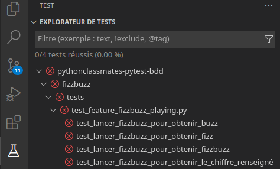
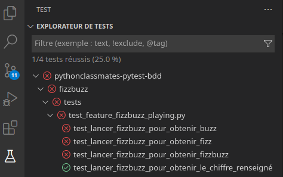
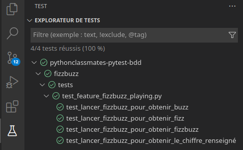

Title: Exemple basique de Pytest-tdd dans VSCode
Date: 2022-08-27 12:42
Category: Article
Slug: pytest-bdd-vscode
Author: ZepmanBC

Le but de ce tuto est de mettre en place le minimum requis pour utiliser pytest-bdd sur VSCode afin de pouvoir suivre la démarche du BDD avec les outils de tests de VSCode et notamment pouvoir utiliser le debugguer de celui-ci.

Je n'expliquerai pas la démarche BDD ici, vous trouverez facilement des exemples de la démarche un peu partout.

## Installation

Il faut:

- Python 3
- VSCode
- Installer le [plugin pytest BDD](https://marketplace.visualstudio.com/items?itemName=vtenentes.bdd) dans VSCode.

Créer un dossier **pythonclassmates-pytest-bdd** par exemple et créer un environnement virtuel comme d'habitude.

Installer pytest-bdd

    pip install pytest-bdd

## L'exemple

On va partir sur un FizzBuzz classique, si vous ne connaissez pas les règles, vous les découvrirez lors de la définition des features.

Créér l'arborescende de base:

    pythonclassmates-pytest-bdd
    └── fizzbuzz
        ├── __init__.py
        ├── main.py
        └── tests
            ├── __init__.py
            └── features
                └── fizzbuzz_playing.feature

Écrire les features dans le fichier **fizzbuzz_playing.feature**.

Tout l'intéret ici est de pouvoir définir les spécifications dans un language courant. L'exemple que je donne n'est pas exhaustif, ce n'est pas le but.

    Feature: Utilisation de FizzBuzz

    Scenario: Lancer FizzBuzz pour obtenir le chiffre renseigné
        Given Je lance FizzBuzz
        When Je renseigne le nombre 1
        Then Le résultat est "1"

    Scenario: Lancer FizzBuzz pour obtenir Fizz
        Given  Je lance FizzBuzz
        When Je renseigne le nombre 3
        Then Le résultat est "Fizz"

    Scenario: Lancer FizzBuzz pour obtenir Buzz
        Given  Je lance FizzBuzz
        When Je renseigne le nombre 5
        Then Le résultat est "Buzz"

    Scenario: Lancer FizzBuzz pour obtenir FizzBuzz
        Given  Je lance FizzBuzz
        When Je renseigne le nombre 15
        Then Le résultat est "FizzBuzz"

Générer le fichier de tests avec cette commande dans la console:

    pytest-bdd generate fizzbuzz/tests/features/fizzbuzz_playing.feature > fizzbuzz/tests/test_feature_fizzbuzz_playing.py

Si vous allez voir le fichier généré vous verez chaque étape des scénarii renseignés.

on peut lancer pytest

    ====================================================== short test summary info =======================================================
    FAILED fizzbuzz/tests/test_feature_fizzbuzz_playing.py::test_lancer_fizzbuzz_pour_obtenir_buzz - NotImplementedError
    FAILED fizzbuzz/tests/test_feature_fizzbuzz_playing.py::test_lancer_fizzbuzz_pour_obtenir_fizz - NotImplementedError
    FAILED fizzbuzz/tests/test_feature_fizzbuzz_playing.py::test_lancer_fizzbuzz_pour_obtenir_fizzbuzz - NotImplementedError
    FAILED fizzbuzz/tests/test_feature_fizzbuzz_playing.py::test_lancer_fizzbuzz_pour_obtenir_le_chiffre_renseigné - NotImplementedError
    ==================================================== 4 failed, 0 passed in 0.36s =====================================================

dans VSCode si on va dans la partie tests (*Configurer les tests > pytest > dossier fizzbuzz*)

On créé notre fonction dans le fichier **./fizzbuzz/main.py** pour initier le programme

    def fizzbuzz_function(value: int) -> str:
        return "1"

Ce code minimal va nous permettre de « brancher » les tests et de valider le cas *je_renseigne_le_nombre_1* de manière naive mais ça permet de vérifier le fonctionnement.

il faut importer notre fonction dans le fichier de tests **fizzbuzz/tests/test_feature_fizzbuzz_playing.py**

    from fizzbuzz.main import fizzbuzz_function

On va définir chaque étape du test

### Given

Dans notre cas il n'y a pas vraiment d'étape initial donc on va mettre `pass`.

    @given("Je lance FizzBuzz")
    def je_lance_fizzbuzz():
        """Je lance FizzBuzz."""
        pass

### When

Ici on va retourner notre fonction avec son argument dans la variable *result*

    @when("Je renseigne le nombre 1", target_fixture="result")
    def je_renseigne_le_nombre_1():
        """Je renseigne le nombre 1."""
        return fizzbuzz_function(1)

### Then

on recupère la variable *result* précement définie

    @then('Le résultat est "1"')
    def le_résultat_est_1(result):
        """Le résultat est "1"."""
        assert result == "1"

On renseigne toutes les étapes **When** et **Then** de la même manière avec les valeurs correspondantes.

On lance pytest

    =========================================================== short test summary info ===========================================================
    FAILED fizzbuzz/tests/test_feature_fizzbuzz_playing.py::test_lancer_fizzbuzz_pour_obtenir_buzz - AssertionError: assert None == 'Buzz'
    FAILED fizzbuzz/tests/test_feature_fizzbuzz_playing.py::test_lancer_fizzbuzz_pour_obtenir_fizz - AssertionError: assert None == 'Fizz'
    FAILED fizzbuzz/tests/test_feature_fizzbuzz_playing.py::test_lancer_fizzbuzz_pour_obtenir_fizzbuzz - AssertionError: assert None == 'FizzBuzz'
    ========================================================= 3 failed, 1 passed in 0.27s =========================================================

sur VSCode

On a bien notre cas avec le nombre 1 qui est passé.

On peut maintenant écrire le reste de notre fonction pour chaque étape. Le but ici étant de mettre en route pytest-bdd ce code qui fait le minimum pour que ça fonctionne suffira. (Ne faites jamais du code comme ça par pitié)

    def fizzbuzz_function(value: int) -> str:
        if value == 1:
            return "1"
        elif value == 3:
            return "Fizz"
        elif value == 5:
            return "Buzz"
        elif value == 15:
            return "FizzBuzz"

si on lance pytest:

    fizzbuzz/tests/test_feature_fizzbuzz_playing.py ....                                                                     [100%]

    ====================================================== 4 passed in 0.03s ======================================================

sur VSCode

Si vous mettez un breakpoint dans le code et que vous lancez les tests dans l'interface VSCode vous pourrez utiliser le debugger.

Le code est téléchargeable [ici](../extra/images/pytest-bdd-vscode/pythonclassmates-pytest-bdd.zip)

Pour aller plus loin la documentation de [pytest-tdd](https://pytest-bdd.readthedocs.io/en/latest/)
